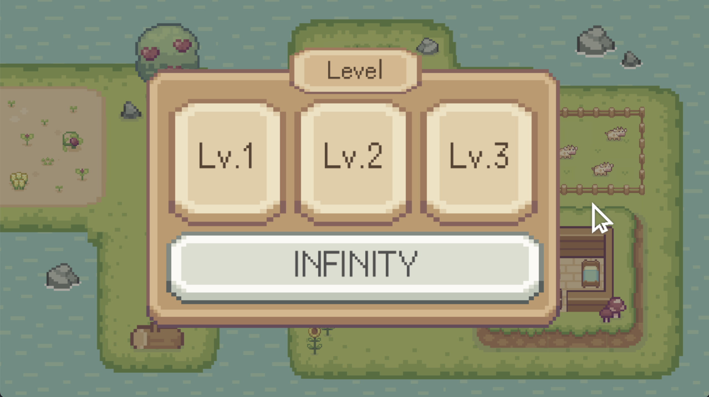

# TABLE OF CONTENT
1. **[INTRODUCTION](#introduction)**

2. **[INSTALLATION](#installation)**

3. **[CONFIGURATION](#configuration)**

4. **[REFERENCE](#reference)**


# INTRODUCTION
**Egg Defense** is a single player python game with levels and different game modes to play with. Take a look what does it look like, you might like it!

### Egg Defense
Place your heroes to withstand the invasion of monsters. You win when the none of the monsters cross the fence.


### Main page
Where you navigate the game.


### Level selection page
Here you can choose which level you want to play. 


### Gesture Control
Having fun playing the game? Gesture Control makes it even more playable, you can pinch to grab, open fingers to place the hero and move around the cursor.

> tips: Switch between gesture control and mouse control in the setting page, it'll remember the setting of last time you playing it.


### Data Base
**Egg Defense** will remember your previous progress and preferred settings, all thanks to the game's Database.


# INSTALLATION
To get started with this project, please install the required dependencies using following code:
```
pip install -r requirements.txt
```

# CONFIGURATION 
>In **["cam_selection.py"](cam_selection.py)** you can define variable **"selected_cam"** to 0-2 to your need.


# REFERENCE
1. [Pygame sprite](<https://www.pygame.org/docs/ref/sprite.html>)
2. [Mediapipe](<https://developers.google.com/mediapipe/solutions/vision/hand_landmarker>)
3. Sound
   - [Click sound](<https://cdn.pixabay.com/download/audio/2022/01/07/audio_c4039878e4.mp3?filename=lclick-13694.mp3&g-recaptcha-response=03AL8dmw-Ah3nyj9QUYvAjyADJnJDeuLQbp5HU1TWknlwJOCnwyJQH0NUaV-N0afcuIPEI0X-V8TBP2MOft9Kf6Ioq8Y9hc1liJdvU5RWTaYgbiS43FhDF9iYxrIogghSiKRYtg1sqntO8MfZp8GE1DnFHDLv5yOb17K2jLBWVd8ggzhCCwBMW>)
   - [Pop sound](<https://cdn.pixabay.com/download/audio/2022/03/10/audio_dbb9bd8504.mp3?filename=pop-39222.mp3&g-recaptcha-response=03AL8dmw_Jo31_KNoIh94G7mRvj_Pa-LhZtMFGXDtsFRMmwbq27wVdwrCLGa-7x1hsq4vpQDqtPsIxbvFP5DwLL_3U0WRalSnTjklSI7gLD8JLDkTsH3Qh6S2C2wnIY24ObNZHcBl31radgEbm4zAb1iLO4bOFUMXLqTeMV_KnK_78RQejzdtWmbC>)
4. Background bgm
   - [Home page](<https://cdn.pixabay.com/download/audio/2023/02/28/audio_696dabe4fe.mp3?filename=lofi-chill-140858.mp3&g-recaptcha-response=03AL8dmw98li2r8fKDLJu6Y2gVTKVsY0Ajbu2N4nrzi-mY7Bnk1tPOAXEY3eUDAnA4r87n6ggMDEPvbe00EAte5gEwOAOu17nec_4Ue2UvTBk4bS693UUEysAbpNNtNc63532tvZBbOLNz-MB6z9p2v4VwvYMXepU3u97fz8oDAwNgywr>)
   - [Game page (normal)](<https://cdn.pixabay.com/download/audio/2022/01/18/audio_d0a13f69d2.mp3?filename=electronic-rock-king-around-here-15045.mp3&g-recaptcha-response=03AL8dmw-Rx_rCH9jAPeFEfttuhwIgaeMdpVinBRCiPWagNOC9siHdwCpy57yc22xRoM3A88hvdbARkIiyWx1ZzNBipuzbSFqM7qeShXRJMrEmv0vkiB51UHYcCdK_i0At5l0d6U92JEZR7Ou0rtNve-hHs3>)
   - [Game page (infinity)](<https://cdn.pixabay.com/download/audio/2021/11/13/audio_da21ce3c29.mp3?filename=cyberpunk-2099-10701.mp3&g-recaptcha-response=03AL8dmw8oXpe9ogZtA2LrjJ4_rRrlhxWUb5W5gnNvtHsuqKiKjgJVrDDYap_hgxohOG2c4lAxJ28E0MNdrmhiweaNjNIsEUEetvIwWrCIcQmJip16rTF8CRJw8MktZUcOdCeJoiCrTB7lTf6lSEqc6OX4-MNl48LSX7sFMMs2dgy>)
   - [Level selection page](<https://cdn.pixabay.com/download/audio/2023/03/02/audio_83db199f04.mp3?filename=stomps-and-claps-percussion-and-rhythm-141190.mp3&g-recaptcha-response=03AL8dmw8xYOzPg-v_Y35NBvwUToKiAzqBbWthvraem19tcAyW86CXY2ASSB946-kIFk5bUg23dOcuFcfzjx_-0u9tOu555aybpBQh7DwzsB3Aa3-LaeUZoy_2WAPlOVgsCWHGLSrI4_ASoiyo2Ns>)
5. Character image
   - [Hero - mushroom](<https://lhteam.itch.io/tiny-mushroom>)
   - [Hero - dog](<https://bdragon1727.itch.io/cat-adventure>)
   - [Hero - frog](<https://pixelfrog-assets.itch.io/pixel-adventure-1>)
   - [Hero - fox](<https://elthen.itch.io/2d-pixel-art-fox-sprites>)
   - [Hero - bee / bird / turkey / rhino / turtle](<ttps://pixelfrog-assets.itch.io/pixel-adventure-2>)
   - [Enemies](<https://pixelfrog-assets.itch.io/treasure-hunters>)
6. Other images
   - [Bullet](<https://bdragon1727.itch.io/fire-pixel-bullet-16x16>)
   - [Background / Button](<https://cupnooble.itch.io/sprout-lands-asset-pack>)

