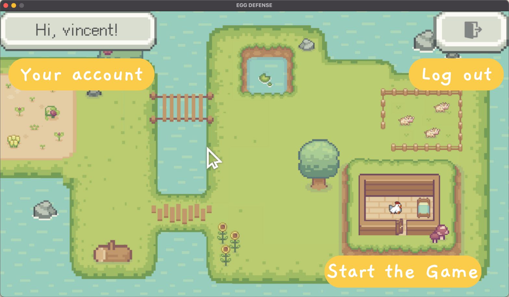

# TABLE OF CONTENT
1. **[INTRODUCTION](#introduction)**

2. **[INSTALLATION](#installation)**

3. **[CONFIGURATION](#configuration)**

4. **[REFERENCE](#reference)**

# INTRODUCTION
**Egg Defense** is a single player python game with levels and different game modes to play with. Take a look what does it look like, you might like it!

### Egg Defense
Place your heroes to withstand the invasion of monsters. You win when the none of the monsters cross the fence.

### Main page
Where you navigate the game.

### Gesture Control
Having fun playing the game? Gesture Control makes it even more playable, you can pinch to grab, open fingers to place the hero and move around the cursor.

> tips: Switch between gesture control and mouse control in the setting page, it'll remember the setting of last time you playing it.

### Data Base
**Egg Defense** will remember your previous progress and preferred settings, all thanks to the game's Database.

# INSTALLATION
//what packages users have to download

# CONFIGURATION 
>In **cam_selection.py** you can define variable **selected_cam** to 0-2 to your need.

# REFERENCE

